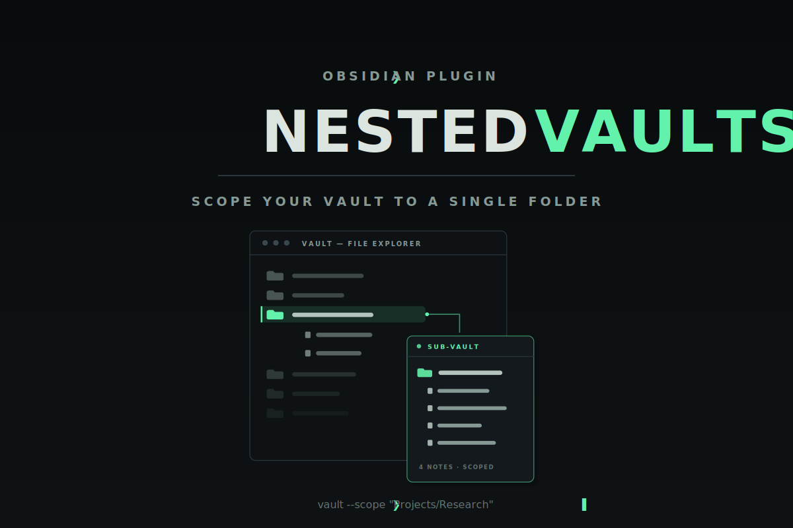

<div align="center">

  

  **Scope your entire Obsidian vault down to a single folder — file explorer, search, graph, tags, and backlinks all respect the boundary.**

  [](LICENSE)
  [](https://github.com/Real-Fruit-Snacks/obsidian-nested-vaults/releases)
  [](https://obsidian.md)

  [Documentation](https://real-fruit-snacks.github.io/obsidian-nested-vaults/) · [Changelog](CHANGELOG.md) · [Report an issue](https://github.com/Real-Fruit-Snacks/obsidian-nested-vaults/issues)

</div>

---

## Overview

A big master vault is great — until you need to spend the afternoon inside one project. Nested Vaults lets you pick any folder and treat it as a temporary vault of its own, without opening a second vault window or losing your plugins, themes, and settings.

While a Sub-Vault is active, the file explorer shows only that folder (plus anything you whitelist), core Search and the Graph views carry a `path:` filter for it, the tag pane shows only tags used inside it, backlinks from outside it are hidden, and opening an outside file is blocked with a notice. Leave the Sub-Vault from the status bar or ribbon and everything returns instantly — nothing about your files is ever changed to make the scoping happen.

## Features

- **File explorer scoping** — folders and files outside the active Sub-Vault are hidden. Parents of the Sub-Vault and of allowed folders stay visible so everything remains reachable.
- **Search and Graph scoping** — a `path:"<sub-vault>"` filter is added to core Search, Graph, and local graph queries, and cleanly removed when you leave. Your own query text is left untouched. Toggleable in settings.
- **Tag pane filtering** — only tags used by notes inside the Sub-Vault are shown, with nested tags (`#project/idea`) matched by their full path.
- **Backlink filtering** — backlinks from notes outside the Sub-Vault are hidden, both in the backlinks pane and in the linked-mentions section at the bottom of notes.
- **Open blocking** — following a link to a file outside the Sub-Vault shows a notice and turns the tab into an empty tab instead of opening the file.
- **Global allowed folders** — whitelist folders like `Attachments` or `Templates` that stay visible and accessible in every Sub-Vault, so embeds and templates never break.
- **Scoped quick switcher** — a quick switcher that searches only inside the active Sub-Vault, with paths shown relative to it.
- **Auto-move new notes** *(opt-in)* — notes created outside the Sub-Vault are moved into it automatically, with links to the moved note updated.
- **Status bar and ribbon** — the status bar shows the active Sub-Vault (click it to leave), and a ribbon action leaves it too. Renaming the scoped folder follows along; deleting it clears the scope.

## Installation

**Requires Obsidian 1.4.10 or newer.**

### Community plugins (recommended)

1. Open **Settings → Community plugins → Browse**.
2. Search for **Nested Vaults**, then **Install** and **Enable**.

### BRAT (for the latest pre-release)

Install [BRAT](https://github.com/TfTHacker/obsidian42-brat), then add `Real-Fruit-Snacks/obsidian-nested-vaults` as a beta plugin.

### Manual

Download `main.js`, `manifest.json`, and `styles.css` from the [latest release](https://github.com/Real-Fruit-Snacks/obsidian-nested-vaults/releases/latest) into `<your-vault>/.obsidian/plugins/nested-vaults/`, then enable Nested Vaults under **Settings → Community plugins**.

## Getting started

1. **Enter a Sub-Vault** — right-click any folder in the file explorer and choose **Set as Active Sub-Vault**, or run **Set Active Sub-Vault** from the command palette.
2. **Work** — the explorer, search, graph, tags, and backlinks are now scoped to that folder.
3. **Leave** — click the Sub-Vault name in the status bar, or the **Leave Active Sub-Vault** ribbon icon, and the whole vault comes back.

### Commands

| Command | Description |
| --- | --- |
| Set Active Sub-Vault | Pick a folder to scope the vault to |
| Clear Active Sub-Vault | Return to the full vault |
| Open Scoped Quick Switcher | Quick switcher limited to the active Sub-Vault |

### Settings

| Setting | Default | Description |
| --- | --- | --- |
| Active Sub-Vault | *(empty)* | The folder currently scoped to; supports autocomplete |
| Auto-move new notes into the Sub-Vault | Off | Move notes created outside the Sub-Vault into it, updating links |
| Scope Search and Graph to the Sub-Vault | On | Add and maintain the `path:` filter in Search and Graph queries |
| Global allowed folders | `Attachments`, `Templates` | Folders that stay visible and accessible in every Sub-Vault |

## How the scoping works

Nested Vaults never moves, locks, or rewrites your files to create the boundary. The file explorer, tag pane, and backlinks are scoped by tagging out-of-scope items with a CSS class that hides them; Search and Graph are scoped by inserting a `path:` token into their query inputs; and out-of-scope files are kept out of view by intercepting file-open events. Disable the plugin (or leave the Sub-Vault) and your vault is exactly as it always was.

Because the boundary is a view-level convenience rather than a permission system, other plugins that read the vault directly can still see the whole vault.

## Architecture

```
nested-vaults/
├── manifest.json    Plugin metadata
├── versions.json    Plugin version → minimum Obsidian version map
├── main.js          Plugin code (single-file CommonJS, no build step)
├── styles.css       One rule: hide elements marked out-of-scope
└── docs/            Documentation site and artwork
```

- **No build step** — a single hand-maintained CommonJS `main.js`, with no framework or bundler.
- **Event-driven** — scoping refreshes on vault, metadata, and layout events plus targeted pane observers, debounced so rapid changes coalesce into one pass.
- **Safe writes** — the only file operation the plugin can perform is the opt-in auto-move, which uses `fileManager.renameFile` so links to the moved note are updated.
- **No network, no telemetry** — the plugin never talks to the network.

## License

Released under the [MIT License](LICENSE).
